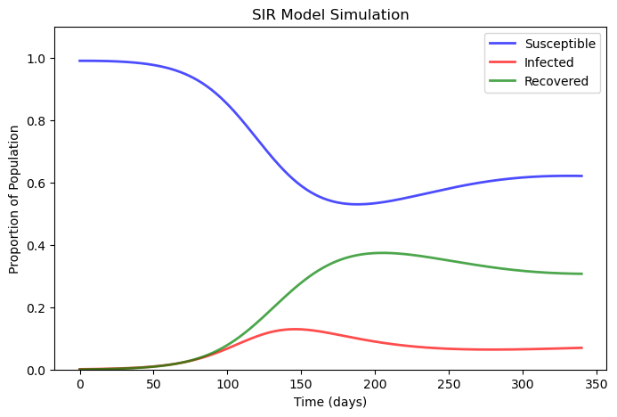
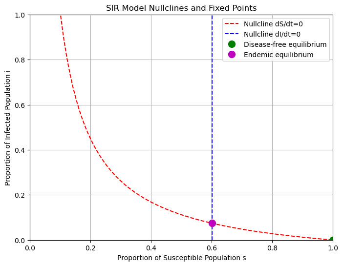

# SIR-
# Dynamics of COVID-19: A SIR Model Analysis

**Author:** Peerapat Phatpanichot  
**Date:** [Today's Date]

## Introduction

Here is the walkthrough of constructing and studying the dynamics of the SIR model using a real-world dataset. The dynamics of COVID-19 and the calibrated parameters we've derived from the Canadian COVID-19 original dataset of the original virus variant.

## Calibrated Parameters

First, we begin with the assumption of the total population being 38 million individuals. During the initial growth phase of the epidemic, we estimated the basic reproduction number, denoted by β. This parameter is critical as it reflects the transmission rate—indicating the probability of an infected individual transmitting the virus to those susceptible in their vicinity.

Our findings indicated that the estimated β stands at 0.119, which means, on average, each infected individual has a chance to infect 11.9% of the susceptible individuals they come into contact with, per day.

We then calculated γ, the recovery rate, the daily recovery percentage within the infected population. Our estimated γ was 0.058, meaning for every 100 infected individuals, approximately 5.8 are expected to recover each day.

Moreover, μ, the natural birth and death rate, was factored into our model, representing an average lifespan of 75 years, which translates to a rate of 1/75 per individual. Lastly, α, the disease-induced death rate, was calculated at 0.002, indicating a daily mortality risk of 0.2% for the infected individuals due to the disease.

By inputting these calibrated parameters into the SIR model's differential equations and performing numerical integration over the dataset's time span, we were able to simulate the epidemic's progression.

## Simulation Results

The simulation, spanning 340 days, demonstrates a classic epidemic curve. The susceptible proportion of the population (`S(t)`), depicted in blue, decreases over time as individuals contract the virus and move into the infected category (`I(t)`). This category, shown in red, initially rises sharply, reflecting the outbreak's growth phase, before declining as individuals recover or succumb to the disease. The recovered population (`R(t)`), colored green, increases over time as individuals recover from the virus, with a gradual plateau indicating the epidemic's slowdown.

The model includes the effects of natural birth and death rates (`μ`) as well as disease-induced mortality (`α`), providing a more realistic scenario where the total population size remains constant, but the dynamics of disease spread and recovery are influenced by these additional factors.

These dynamics are crucial for understanding the potential impact of public health interventions and can be used to inform policy decisions. The model suggests that without any interventions, the epidemic will eventually reach a steady state, where the number of new infections is balanced by the number of recoveries and deaths.

## SIR Model Dynamics

### Nullclines and Fixed Points

In this segment of the paper, we delve deeper into the dynamics of our SIR model for the dataset. We analyze the nullclines, fixed points, and perform a stability analysis to comprehend the potential long-term behavior of the epidemic within the population.

We begin by plotting the nullclines for our system. These are the curves along which the rate of change of our susceptible and infected populations is zero, essentially where the system is in a state of equilibrium. The red dashed line represents the nullcline where the rate of change of the susceptible population is zero, and the blue dashed line represents the nullcline for the infected population.

The fixed points, where these nullclines intersect, give us critical insights:
- The Disease-Free Equilibrium occurs at full susceptibility with no infections, depicted by the green marker. Here, \(s^* = 1\), meaning the entire population is susceptible, and \(i^* = 0\), indicating no current infections.
- The Endemic Equilibrium, shown by the magenta marker, is where the disease persists in the population at stable levels. The values \(s^* = 0.601\) and \(i^* = 0.0744\) suggest that 60.1% of the population remains susceptible while 7.44% is infected in the long term.

The nullclines, which represent the points where the rate of change of susceptible (\(s\)) and infected (\(i\)) individuals is zero, are depicted in the following figure. These curves are critical for understanding the system's behavior at equilibrium.

- For \(\frac{ds}{dt} = 0\), the nullcline is
  \[i = \frac{\mu (1 - s)}{\beta s}\].
- For \(\frac{di}{dt} = 0\), the nullcline is a vertical line at
  \[s = \frac{\delta}{\beta}\].

The fixed points (\(s^*\), \(i^*\)) are where these nullclines intersect, indicating the system's potential long-term behavior:
- Disease-free equilibrium: \((s^*, i^*) = (1, 0)\), where the population is fully susceptible and there are no infections.
- Endemic equilibrium: \((s^*, i^*) = \left(\frac{\delta}{\beta}, \frac{\mu (1 - \frac{\delta}{\beta})}{\delta}\right)\), where the disease persists at stable levels within the population.

For the given parameters, the endemic equilibrium is approximately \((0.6009, 0.0744)\), as shown by the magenta dot in the phase portrait.

